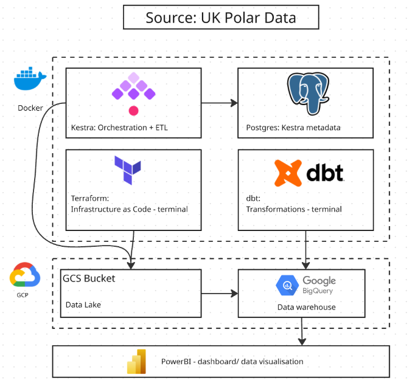
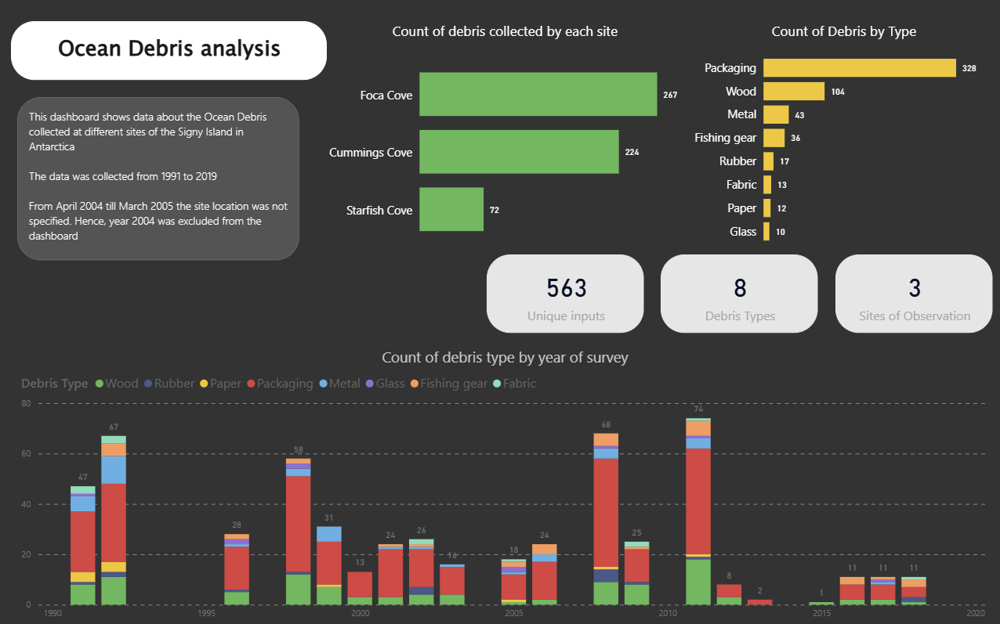

# zoomcamp_uk_polar_data
This is a final project for the Data Engineering Zoomcamp 2026 focused on processing the data from the UK Polar Data Centre

## Architecture


## Problem Statement

Marine debris polution is a growing environmental concern. Marine debris has been monitored on Signy Island, Antarctica since 1991 by British Antarctic Survey. This reserach contributes to the CCAMLR Marine Debris Program. 

Dataset used: https://ramadda.data.bas.ac.uk/repository/entry/show?entryid=ee9ce4f4-cad6-4c2e-bc06-4757dc87f7e4

This dataset was created by Waluda, C., & Dunn, M. J. (2023). Beached marine debris from Signy Island, South Orkney Islands, Antarctica, from 1991 to 2019. (Version 1.0) [Data set]. NERC EDS UK Polar Data Centre. https://doi.org/10.5285/EE9CE4F4-CAD6-4C2E-BC06-4757DC87F7E4


This project builds an automated data pipeline to process and analyse 30+ years of beach debris survey data collected across three sites on Signy Island: Foca Cove, Cummings Cove, and Starfish Cove.

This project answers key environmental questions:
- What is the most commonly found type of debris?
- Which sites have the most marine debris?
- How has debris collection changed over the past years?

Understanding this patterns can help researchers monitor pollution trend in Antarctica

## Technologies Used
- **Terraform** - Infrastructure as Code (GCP setup)
- **Docker** - Containerisation
- **Kestra** - Workflow orchestration + data ingestion
- **Google Cloud Storage** - Data lake
- **BigQuery** - Data warehouse
- **dbt** - Data transformations
- **PowerBI** - Dashboard building

## Pipeline Overview
the ETL (Extract Transform Load) pipeline
1. **Terraform** provisions GCP infrastructure 
   (GCS bucket + BigQuery dataset)

2. **Kestra** orchestrates the entire data pipeline:
   - Downloads CSV from UK Polar Data Centre
   - Uploads raw CSV to GCS bucket (data lake)
   - Creates external table pointing to GCS
   - Creates temp table with unique row IDs
   - Merges data into final BigQuery table
   - Purges temporary files

3. **dbt** transforms raw BigQuery data into analytical models
   - Cleans raw data from Big Query
   - Split season column into a separate year and month which makes it suitable for further analytics
   
5. **PowerBI** visualises the transformed data

## The dashboard
PowerBI tool for data visualisation was used because it is a common tool in industry. This enables quick visuals. PowerBI was connected to the GCP to retrieve the processed data.
The dashboard itself was uploaded as ```Beach Debris dashboard.pbix```


   
## Reproducibility
Before running the docker compose up command, make sure that your GCP credentials are added:
```
echo $GCP_CREDS > /tmp/gcp-credentials.json
```
After that, you can run everything
```
docker compose up
```

Please note, you need to install the Power BI to use the dashboard. I've added the screenshot with the dashboard in case if you could not access it.
